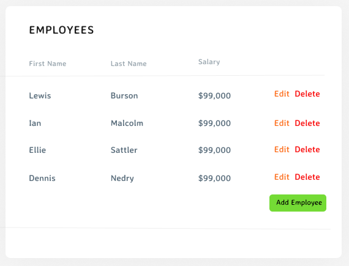

# Take-home Assignment (Full Stack) #

### Goal: ###
* Create an Employee Table like the one in the image below.
* Use any front-end framework (Angular, React, Vue, ect...) or CSS library to accomplish this.
* Implement the back-end API with a Node.js framework, and a SQL database



### Functional Requirements: ###
* Initially, list all employees that are in data.json
  * First name, last name, and salary in currency format (ie. $42,000)
* The ability to edit an employee
* The ability to delete an employee
* The ability to create a new employee

### Technical Guidelines: ###
* Structure your application and components in a modular/reusable way
* Commit code with useful and informative comments
* Your application doesn't have to use the data.json file directly, but have a SQL script to initialize your database with data found in that file
* Implement API code to read and write to a SQL database
* Styling: CSS or SCSS or SASS can be used, whichever you prefer (can use popular UI frameworks like Bootstrap as well)

### Questions? ###
Please reach out to me with any questions

### Deployment Instructions: ###
To run the app locally you will need a running MYSQL database.
Additionally within `backend/` a `.env` file will need to be provided with the following environment variables:
```
DB_PORT=your_db_port
SERVER_PORT=5000
DB_HOST=your_db_host
DB_USER=your_qb_user
DB_PASS=your_db_pass
MYSQL_DB=your_db
```
Once this is done the database can have its database initialized, from the project root:
```
$ cd backend
backend:$ npm install
backend:$ npm run db_init
```
To run the backend run:
```
backend:$ npm run start
```
Once the backend is running to run the frontend perform the following:
```
backend:$ cd ../frontend
frontend:$ npm install
frontend:$ npm run prepare
frontend:$ npm run dev
```
The application should now be running at `http://localhost:5173/`

#### Sample Image: ####


#### Tech Stack: ####
Backend: Node + Express

Frontend: Svelte with Svelte material ui.
